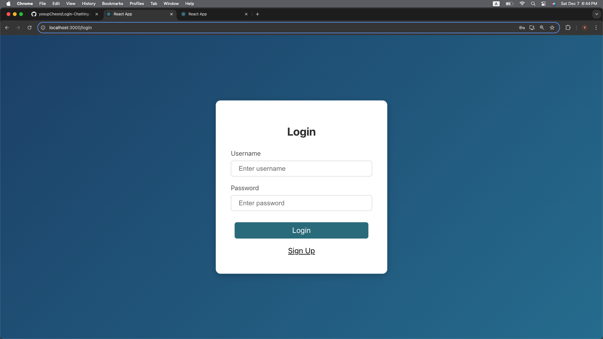
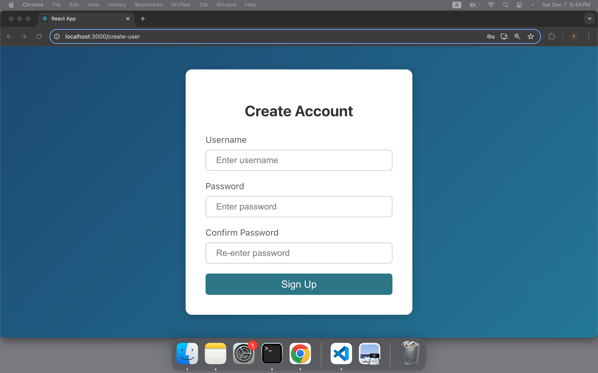
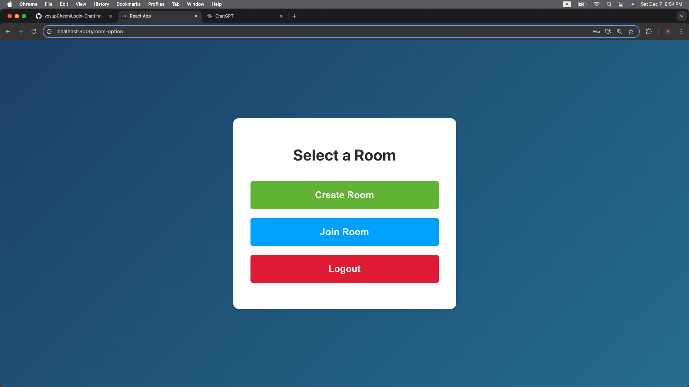
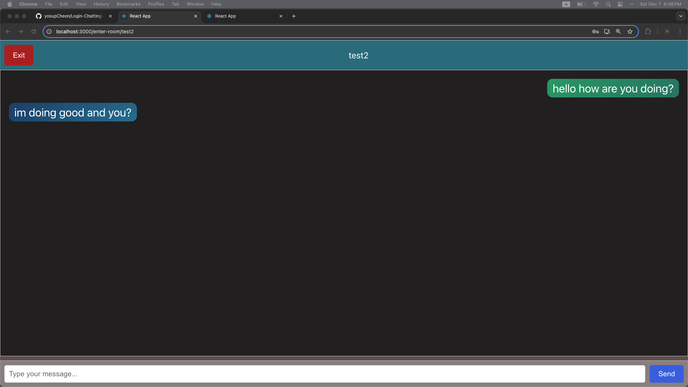

# Login-Chatting-App

## Overview
This is a plan for Login-Chatting web app.

## Preview

This is a login interface where users provide valid credentials to access their accounts.

This is a sign-up interface where users can create an account.  
Each username must be unique; if a username already exists, an error message will be displayed.

This is an options page where logged-in users can either create a new room or join an existing one.

  
  

This is a popup overlay with options to create or join a room.
  

This shows the appearance when a user sends and receives messages.

This shows how it appears on the other user's end.

## Fundamental User Story:
- a user can login with their credential
- a user can create an account
- a user can login -> create a room
- a user can login -> join a room
- users can communicate real-time

## To Run the Program
- specify the .env file as .env-example
- run "npm start" in both frontend and backend folder
- then react frontend will start on the specified url+port (localhost)
- direct to "url:port/login" to login or creat an account

## Tech Stacks
#### Frontend
- HTML/CSS/Javascript
- React (Typescript)
#### Backend
- Node
- Express
- Typescript
- Websocket.io
- JWT Session (maybe later)
#### Database
- MySQL
#### Server
- host server, maybe cloud, but for now test on ngrok
- what is nginx

## API Endpoints + Socket communication
#### login (username=String, password=String)
- POST request
- check with db
- return 200 and token session for later header?
- else 400
#### create_account (username=String, password=String)
- POST request
- save it to the db
- return 200 if success else 400
#### update_account (username=String, password=String)
- PUT OR PATCH request
- update a user info in db
- return 200 if success else 400
#### delete_account (username=String, password=String)
- DELETE request
- delete a user's account in db
- return 200 if success else 400

#### create_room (Websocket vs Socket io)
- io.on(connect)...
- create room in db
- socket.join()
- send msg
#### join_room
- io.on(connect)... 
- socket.join()
- send msg
- if room is full -> msg:”room is full!”

## DATABASE Table (MySQL)
### User (add delete and update to api endpoints)
| Column Name | Data Type | Constraints                |
|-------------|-----------|----------------------------|
| id         | INT       | PRIMARY KEY, AUTO_INCREMENT | 
| username    | VARCHAR(50) | NOT NULL     |
| password(hash?)    | VARCHAR(50) | NOT NULL     |
### Room
| Column Name | Data Type | Constraints                |
|-------------|-----------|----------------------------|
| id         | INT       | PRIMARY KEY, AUTO_INCREMENT | 
| username    | STRING OR INT | NOT NULL     |
| room_occupy| INT | CHECK (CONTAINS <= 2)|

## Fronend Pages
#### Login Page
- greeting, "Welcome!"
- username input field
- password input field
- login button
- create new account button
#### Creating New Account Page
- new username field
- new password field
- re-enter password field
- register button
#### Board Page (Successfully Log-in)
- creating a room option button
- join a room option button
#### Creating a Room Page
- room number(name) input field
- create a room button
#### Joining a Room Page
- room number input field
- join a room button
#### Chatting Room Page
- friend's chat on left side
- my chat on right side
- message preview bar (typed inputs)
- message sending button

## To Create DB
- now running locally (or test with ngrok)
- create .env to define details in db.ts
- and connect db and the backend

## TODO Documenting:
- ~~Documenting use story and tech stacks~~
- ~~create github project and push~~
- ~~create and design API end-points~~
- ~~database design~~
- ~~pages for frontend~~

## TODO Coding:
- Authentication
    - JWT vs Session?
- Frontend
    - React, Typescript, HTML/CSS/BootStart
    - ~~for pages and emit to server~~
    - two client communication through backend (socket.io)
- Backend
    - ~~Node, Express, Typescript, RESTapi for server~~
        - ~~maybe use ngrok for testing~~
        - web hosting, cloud, after testing...
    - ~~for res, rep~~
    - ~~for defining dB~~
    - ~~for communicating with dB~~
    - ~~WebSocket vs Socket(io) for live-chatting~~
- Database
    - ~~MySQL~~
    - run in a docker
    - ~~run in a server later~~